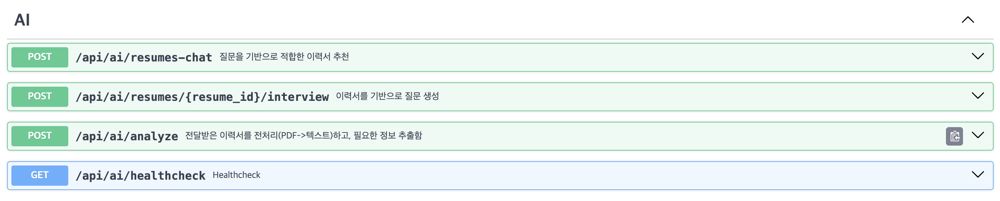

## 💡 Getting Started
```
sh build.sh
```

## 💡 API 명세
```
# FastAPI 앱 구동 후 동작
http://localhost:8000/docs
```

## 🛠 기술 스택
- **Framework:** FastAPI
- **Language:** Python 
- **LLM:** LangChain(model engine=OpenAI)
- **VectorDB:** Chroma

