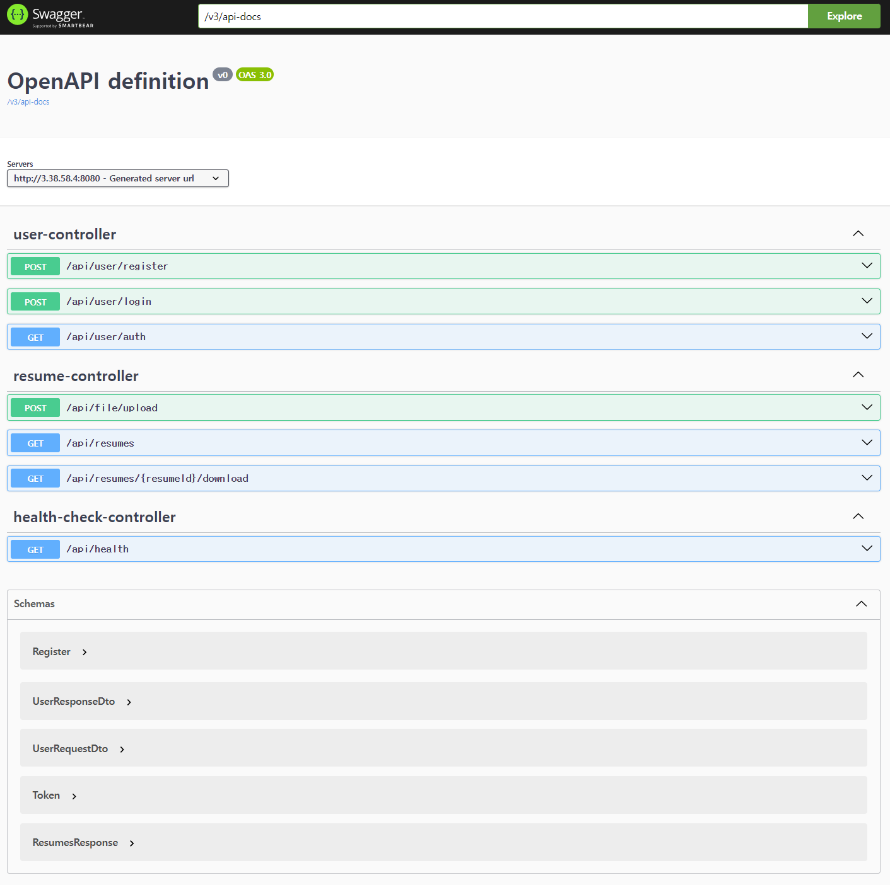

## 💡 Getting Started
```
```

## 💡 API 명세
```
```


## 🛠 기술 스택
- **Framework:** Spring Boot 3.2
- **Language:** Java 17
- **Database:** MySQL
- **ORM:** JPA/Hibernate
- **Security:** JWT
- **Documentation:** Swagger/OpenAPI
- **Build Tool:** Gradle
- **Testing:** JUnit 5, Mockito
